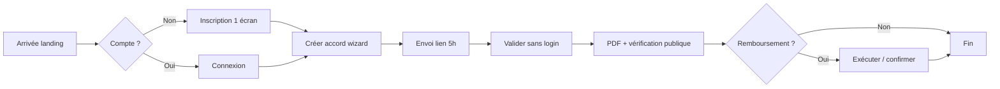

# Refonte UI/UX premium — Zéro-Palabre (mode clair)

**Design read :** plateforme trust-first B2B/pro pour artisans et particuliers (Togo / Afrique de l'Ouest), langage Stripe/Notion, fond clair uniquement, tokens teal/ambre existants.

## 1. Audit avant/après

| Problème | Sévérité | Impact | Résolution |
|----------|----------|--------|------------|
| Fond global midnight + hero sombre | Critique | Contraste fatigant, hors charte « pas de mode sombre » | Fond `neutral-50` + dégradés teal légers |
| Sidebar dashboard sombre | Critique | Incohérence marketing ↔ app | Sidebar blanche `glass-sidebar` |
| 3 colonnes features identiques | Moyen | Look template IA | Bento grid asymétrique |
| Boutons ghost blancs sur fond clair | Moyen | Illisibles | Variantes button recalibrées |
| Hash / terminal noir sur pages publiques | Moyen | Rupture visuelle | Encarts `neutral-50` + mono |
| Panneaux auth split dark | Moyen | Friction onboarding | Panneau `primary-50` + logo vert |
| `picsum` avatars hero | Mineur | Incohérence marque | Initiales locales |
| Deux CTA primaires landing | Mineur | Règle produit | 1 CTA hero + 1 CTA final section |

## 2. Parcours utilisateur optimisé



**Tunnel :** 1 CTA principal par écran · retour toujours visible · fil d'Ariane implicite (stepper accords).

## 3. Architecture de l'information (sitemap)

```
/ ........................... Landing (hero, features, méthode, CTA)
├── /inscription, /connexion . Auth
├── /installer, /cgu, /confidentialite . Aide & légal
├── /valider/[token] ........ Validation destinataire
├── /verifier/[token] ....... Preuve publique
├── /executer/[fulfillToken] . Déclaration remboursement
└── (dashboard)
    ├── /accords .............. Liste
    ├── /accords/nouveau ...... Création
    ├── /accords/[id] ......... Détail + exécution
    ├── /profil ............... Compte & stats
    └── /abonnement ............. Plans
```

## 4. Design tokens (implémentation : `src/app/globals.css`)

| Token | Valeur / usage |
|-------|----------------|
| Primaire | `--color-primary-800` teal #0F6E56 |
| Fond page | `neutral-50` + radial teal/ambre 5–8 % |
| Surface carte | `glass-card` blanc 92 % + blur 16px |
| Texte | `neutral-950` / secondaire `neutral-600` |
| Espacement | base 8px, `--page-padding-x` clamp |
| Radius | sm 8px · lg 16px · 2xl 32px hero cards |
| Ombre | `--shadow-glass` tintée teal |
| Motion | 220ms `--ease-out`, scale 0.98 au tap |

## 5. Micro-interactions

- **Hover cartes :** `translateY(-2px)` + ombre glass (GPU transform)
- **Boutons :** `whileTap` scale 0.98 (framer-motion)
- **Sidebar :** indicateur actif `layoutId` spring
- **Scroll :** `scroll-behavior: smooth` sur `html`
- **Reduced motion :** désactive hover-lift
- **Reduced transparency :** fond opaque sans blur

## 6. Fichiers refondus (implémentation)

- `globals.css` — tokens & utilities light
- `button.tsx`, `card.tsx`, `input.tsx`
- `site-header.tsx`, `site-footer.tsx`, `dashboard-shell.tsx`
- `public-page-shell.tsx`, `hero-section.tsx`, `interactive-features.tsx`, `final-cta.tsx`
- `(marketing)/page.tsx` — composition modulaire
- Pages auth, valider, verifier (encarts clairs)

## 7. Checklist accessibilité (WCAG AA cible)

- [x] Focus ring teal visible
- [x] Touch targets ≥ 44px
- [x] Labels visibles formulaires
- [x] Contraste texte fond clair
- [ ] Audit contrastes automatisé à planifier
- [ ] Navigation clavier menus mobile à tester
