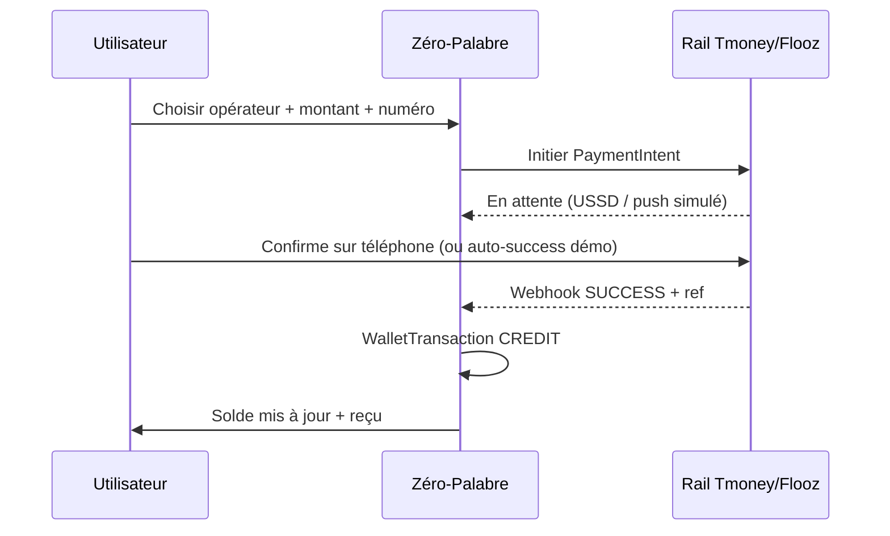
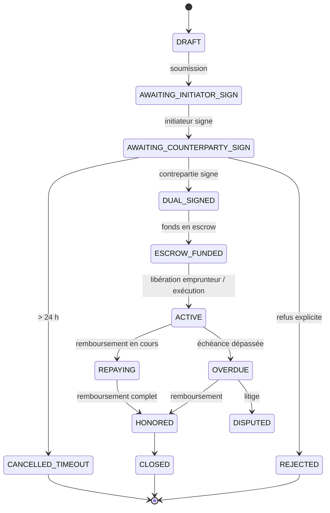

# Direction produit — Acte notarial, portefeuille & double signature

> **Statut** : décisions figées (brainstorming juin 2026) · **Remplace progressivement** le PDF preuve simple pour les flux financiers  
> **Complète** [`CONTREPARTIE-PREUVE.md`](./CONTREPARTIE-PREUVE.md) et [`EXECUTION-ACCORD.md`](./EXECUTION-ACCORD.md)  
> **Partenaires** : notaire identifié (Togo) · rails Tmoney / Flooz (intégration réelle ou façade indiscernable en démo)

---

## 1. Promesse produit (nouvelle)

**Zéro-Palabre** ne se limite plus à une preuve PDF horodatée : pour les accords avec enjeu financier, la plateforme produit un **acte notarial pré-validé** (template + cachet notaire statique), une **double signature** (nom tapé + horodatage), un **portefeuille intégré** (Tmoney / Flooz), et un **escrow plateforme** jusqu’à la première phase de remboursement.

**Principe :** pas de double signature dans les 24 h → **pas d’accord**, **aucun transfert**.  
**Fin réelle du processus :** remboursement (ou exécution équivalente) **via l’application** lorsque les parties le font volontairement.  
**En cas de non-remboursement :** la plateforme **n’intervient pas** — les parties disposent de l’**acte notarial PDF** pour saisir la justice.

---

## 2. Décisions métier (figées)

| # | Sujet | Décision |
|---|--------|----------|
| 1 | Acte notarial | **Template pré-validé une fois** par le notaire partenaire ; **cachet = image/PDF statique** sur le document final |
| 2 | Champs obligatoires acte | Nom, prénom, nom de famille, **@id**, téléphone, **date de naissance**, **adresse**, **montant en lettres**, description de l’accord |
| 3 | Contrepartie | Identifiée par **@id unique** (ex. `@koffi_mensah`) + **nom** ; **compte + portefeuille obligatoires** pour signer **et** recevoir |
| 4 | Ordre signature | **Initiateur d’abord**, puis contrepartie |
| 5 | Mode signature | **Nom tapé** (engagement) + horodatage + trace technique (IP, session) |
| 6 | Délai contrepartie | **24 h** après signature initiateur ; sinon **annulation** — pas d’accord, pas de mouvement |
| 7 | Déblocage fonds (prêt) | Après double signature → montant vers **escrow plateforme** (pas directement emprunteur) |
| 8 | Sortie escrow (prêt) | Libération vers emprunteur selon règles prêt (voir §5) ; escrow maintenu jusqu’à **premier remboursement** ou règle métier définie |
| 9 | Mode remboursement | **Choix à la création** par l’initiateur : (A) déclaration + confirmation ou (B) prélèvement programmé à l’échéance |
| 10 | Défaut | **Relances** informatives uniquement ; **pas de pénalités** ni recouvrement par la plateforme |
| 11 | Plafonds / KYC | **Aucun plafond** ni seuil KYC obligatoire **pour l’instant** |
| 12 | Périmètre types | **Tous** (prêt, prestation, location, commande, autre) — **flux différents** par type |
| 13 | Portefeuille MVP | **Expérience 100 % réelle** : dépôt, solde, historique, retrait — le jury ne doit pas percevoir l’absence d’agrégateur API réel |
| 14 | Lancement | **Notaire + wallet + double signature** livrés ensemble (pas de découpage « preuve simple seule » en prod cible) |

---

## 3. Architecture portefeuille (façade production)

### 3.1 Objectif démo / jury

L’utilisateur doit pouvoir :

1. **Déposer** via Tmoney ou Flooz (choix opérateur, numéro, montant)
2. Voir un **écran de confirmation** type opérateur (référence transaction, statut)
3. Voir son **solde mis à jour** en temps réel
4. Consulter un **historique** (dépôt, blocage escrow, libération, remboursement, pénalité)
5. **Retirer** vers son numéro Mobile Money

Aucun libellé « simulation », « test », « MVP » dans l’UI.

### 3.2 Implémentation technique recommandée

```text
UI (dépôt / retrait)
    ↓
API /api/wallet/deposit | withdraw | balance
    ↓
WalletLedgerService (source de vérité solde + mouvements)
    ↓
PaymentRailAdapter (interface)
    ├── TmoneyAdapter   → impl. MVP : webhook interne / polling simulé
    └── FloozAdapter    → idem
```

| Couche | Rôle |
|--------|------|
| `Wallet` | Solde disponible, solde bloqué (escrow), devise FCFA |
| `WalletTransaction` | CREDIT, DEBIT, ESCROW_LOCK, ESCROW_RELEASE, TRANSFER_IN, TRANSFER_OUT |
| `PaymentIntent` | Dépôt en cours (PENDING → SUCCEEDED / FAILED), ref externe type `TM-20260602-X8K2` |
| `PaymentRailAdapter` | Abstraction : plus tard branchement API opérateur sans changer l’UI |

**Règle :** toute opération wallet passe par une **transaction ledger immuable** (comme `AccordEvent`).

### 3.3 Flux dépôt (UX cible)



---

## 4. Parcours utilisateur — Prêt (référence)

### 4.1 Prérequis

- Compte connecté, **@id** renseigné, identité complète (naissance, adresse)
- **Portefeuille** avec solde ≥ montant du prêt (vérifié avant signature initiateur)

### 4.2 Étapes

| # | Acteur | Écran | Action |
|---|--------|-------|--------|
| 1 | Initiateur | Nouvel accord → **Prêt** | Montant, échéance, description, **mode remboursement** (A ou B), @id + nom emprunteur |
| 2 | Initiateur | Récap + solde wallet | Vérification solde suffisant |
| 3 | Initiateur | Signature | Saisie **nom complet** → `INITIATOR_SIGNED` |
| 4 | Plateforme | Génération brouillon acte | Pré-remplissage template + montant en lettres |
| 5 | Contrepartie | Notification in-app (+ push/SMS) | « @koffi_mensah, @marie vous invite à signer un prêt » |
| 6 | Contrepartie | Parcours signature (24 h) | Vérif identité, lecture acte, **nom tapé** → `COUNTERPARTY_SIGNED` |
| 7 | Plateforme | Scellement | Cachet notaire statique + PDF final + hash |
| 8 | Plateforme | Escrow | `ESCROW_LOCK` : prêteur → escrow plateforme (montant prêt) |
| 9 | Plateforme | Libération emprunteur | Transfert escrow → wallet emprunteur (règle : immédiat post-signature ou J+0) |
| 10 | Emprunteur | Remboursement | Selon mode choisi (§5) |
| 11 | Plateforme | Clôture | Accord `CLOSED` / `HONORED` + attestation exécution |

### 4.3 Timeout 24 h

```text
INITIATOR_SIGNED + 24 h sans COUNTERPARTY_SIGNED
  → statut CANCELLED_TIMEOUT
  → aucun ESCROW_LOCK
  → notification initiateur « Accord non conclu »
```

---

## 5. Escrow & remboursement (prêt)

### 5.1 Escrow

| Événement | Mouvement ledger |
|-----------|------------------|
| Double signature OK | Prêteur : `-montant` (disponible) · Escrow plateforme : `+montant` |
| Libération emprunteur | Escrow : `-montant` · Emprunteur : `+montant` |
| Premier remboursement validé | Escrow libéré / clôture selon règle métier (escrow « actif » jusqu’à 1er remboursement) |

> **Note produit :** l’escrow protège le prêteur jusqu’à ce que la chaîne de remboursement démarre ; affiner la libération partielle en phase 2.

### 5.2 Modes remboursement (choix création)

| Mode | Code | Comportement |
|------|------|--------------|
| **Mutuel** | `MUTUAL_CONFIRM` | Emprunteur déclare → prêteur confirme → `WalletTransaction` emprunteur → prêteur |
| **Auto échéance** | `SCHEDULED_DEBIT` | À `dateEcheance`, tentative prélèvement wallet emprunteur ; échec → relance + pénalité |

Les deux modes peuvent coexister sur des accords différents ; **un seul mode par accord**, figé à la création.

---

## 6. Flux par type d’accord (esquisse)

| Type | Escrow / wallet | Signature | Fin processus |
|------|-----------------|-----------|-----------------|
| **Prêt** | Oui — prêteur → escrow → emprunteur | Double, 24 h | Remboursement in-app + pénalités |
| **Prestation** | Acompte ou solde selon montant | Double, 24 h | Validation livrable + solde restant |
| **Location** | Caution + loyer (à détailler) | Double, 24 h | Restitution caution |
| **Commande** | Paiement à la commande ou livraison | Double, 24 h | Confirmation réception |
| **Autre** | Selon champs financiers | Double, 24 h | Exécution définie à la création |

Chaque type = **variante de template notarial** + **graphe wallet** propre.

---

## 7. Machine à états (`Accord.statut` — cible)



**Compatibilité :** mapper les statuts actuels (`SENT`, `VIEWED`, `ACCEPTED`…) vers cette machine lors de la migration.

---

## 8. Modèle de données (cible)

### 8.1 `User` (extensions)

```prisma
username        String   @unique  // @koffi_mensah sans le @ en base ou avec — à trancher
dateOfBirth     DateTime?
address         String?  @db.Text
phoneVerified   DateTime?
```

### 8.2 Portefeuille

```prisma
model Wallet {
  id              String   @id @default(cuid())
  userId          String   @unique
  currency        String   @default("XOF")
  balanceAvailable Decimal @db.Decimal(18, 2)
  balanceEscrow    Decimal @db.Decimal(18, 2) @default(0)
  createdAt       DateTime @default(now())
  updatedAt       DateTime @updatedAt
  user            User     @relation(...)
  transactions    WalletTransaction[]
}

model WalletTransaction {
  id            String   @id @default(cuid())
  walletId      String
  type          WalletTxType  // CREDIT, DEBIT, ESCROW_LOCK, ESCROW_RELEASE, PENALTY
  amount        Decimal  @db.Decimal(18, 2)
  balanceAfter  Decimal  @db.Decimal(18, 2)
  accordId      String?
  paymentRef    String?  // TM-20260602-X8K2
  rail          PaymentRail? // TMONEY, FLOOZ
  status        WalletTxStatus
  metadata      Json?
  createdAt     DateTime @default(now())
}

model PaymentIntent {
  id          String   @id @default(cuid())
  userId      String
  rail        PaymentRail
  amount      Decimal  @db.Decimal(18, 2)
  phone       String
  externalRef String?
  status      PaymentIntentStatus // PENDING, SUCCEEDED, FAILED
  createdAt   DateTime @default(now())
  completedAt DateTime?
}
```

### 8.3 Acte notarial & signatures

```prisma
model NotarialTemplate {
  id          String   @id @default(cuid())
  version     String   // v1.0-pret-togo
  accordType  AccordType
  stampUrl    String   // cachet notaire (image/PDF statique)
  fieldsSchema Json    // champs prédéfinis
  active      Boolean  @default(true)
}

model AccordNotarialAct {
  id            String   @id @default(cuid())
  accordId      String   @unique
  templateId    String
  filledFields  Json     // nom, adresse, montantLettres, etc.
  pdfUrl        String?
  contentHash   String?
  generatedAt   DateTime?
}

model AccordSignature {
  id          String   @id @default(cuid())
  accordId    String
  userId      String
  role        SignatureRole // INITIATOR, COUNTERPARTY
  signedName  String
  signedAt    DateTime @default(now())
  ipAddress   String?
  userAgent   String?
}
```

### 8.4 `Accord` (extensions)

```prisma
counterpartyUsername  String?   // @id cible
repaymentMode         RepaymentMode? // MUTUAL_CONFIRM | SCHEDULED_DEBIT
inviteExpiresAt       DateTime? // +24h après signature initiateur
```

---

## 9. Écrans à concevoir (checklist)

### Global
- [ ] Portefeuille : solde, dépôt, retrait, historique
- [ ] Profil : @id, date naissance, adresse
- [ ] Notifications : demande de signature

### Création accord (prêt)
- [ ] Formulaire + choix mode remboursement
- [ ] Recherche contrepartie par @id
- [ ] Vérification solde
- [ ] Signature initiateur (nom)

### Contrepartie
- [ ] Inbox « Accords en attente »
- [ ] Lecture acte pré-rempli
- [ ] Signature (nom) + refus

### Post-signature
- [ ] Téléchargement acte notarial PDF
- [ ] Suivi escrow + remboursement
- [ ] Relances & pénalités (bandeaux factuels)

---

## 10. Intégration notaire (MVP)

1. Notaire fournit **template Word/PDF** + **image cachet** + liste champs obligatoires
2. Équipe Zéro-Palabre mappe champs → `NotarialTemplate.fieldsSchema`
3. Génération PDF : `@react-pdf/renderer` ou remplissage PDF existant (pdftk / lib PDF)
4. **Pas de validation humaine par acte** au MVP — le cachet statique vaut pour tous les actes générés sous ce template versionné

---

## 11. Relation avec l’existant

| Existant | Évolution |
|----------|-----------|
| PDF preuve + hash | Remplacé par **acte notarial** pour flux wallet |
| `/valider/[token]` sans compte | Remplacé par **notification + compte obligatoire** |
| `AccordFulfillment` | Conservé, branché sur **WalletTransaction** |
| `ReliabilityScore` | Alimenté par `HONORED`, retards, pénalités |
| Validité lien 5 h | Remplacé par **24 h post-signature initiateur** pour prêt notarial |

---

## 12. Litiges & non-remboursement

| Règle | Décision |
|--------|----------|
| Pénalités automatiques | **Non** — aucun prélèvement pénalité par la plateforme |
| Recouvrement | **Non** — Zéro-Palabre ne poursuit pas le débiteur |
| Relances | **Oui** — emails / notifications factuelles avant et après échéance |
| Recours parties | **Acte notarial PDF** + historique wallet → saisine **justice** par les parties |
| Statut `DISPUTED` | Optionnel informatif ; pas de workflow arbitrage plateforme au MVP |

### Points encore à trancher

| # | Sujet | Proposition par défaut |
|---|--------|------------------------|
| 1 | @id en base | Stocker `koffi_mensah` sans `@`, afficher avec `@` |
| 2 | Libération escrow → emprunteur | **Immédiate** après double signature |
| 3 | Retrait wallet | Minimum 500 FCFA, frais 0 FCFA MVP |
| 4 | Templates par type | v1 prêt seul en dev ; autres types v1.1 |

---

## 13. Plan d’implémentation suggéré

| Sprint | Livrable |
|--------|----------|
| **S1** | ✅ `@id`, identité étendue, portefeuille (dépôt/retrait Tmoney/Flooz), ledger |
| **S2** | `Wallet` + ledger + UI dépôt/retrait (façade Tmoney/Flooz) |
| **S3** | `NotarialTemplate` + génération PDF prêt + cachet |
| **S4** | Double signature (initiateur → 24 h → contrepartie) + notifications |
| **S5** | Escrow + libération + choix mode remboursement |
| **S6** | Relances informatives, clôture + migration statuts |

---

## 14. Copy & conformité

- Ne jamais afficher « simulation » ou « agrégateur »
- Mention légale footer acte : *« Acte généré sur template validé par [Notaire X], [Ville], [Date validation template] »*
- Rappel : Zéro-Palabre n’est pas une banque ; portefeuille = **service de paiement** encadré (à valider juridiquement Togo)

---

*Document vivant — mettre à jour après validation pénalités et règles escrow détaillées avec le notaire partenaire.*
