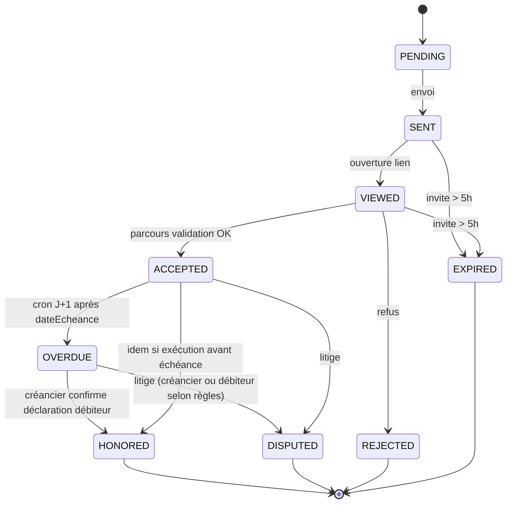

# Exécution des accords — Spécification produit & technique

> **Complément de** [`CONTREPARTIE-PREUVE.md`](./CONTREPARTIE-PREUVE.md) (signature) · **Statut** : MVP implémenté  
> Wireframes interactifs : écrans A–G (dashboard, débiteur, créancier, vérification publique, profil, PDF).

---

## 1. Problème & promesse

| Phase | Question | Couvert aujourd’hui | Cible |
|--------|----------|---------------------|--------|
| **Signature** | La bonne personne a-t-elle accepté ces termes ? | Oui — parcours `/valider`, hash, PDF | Inchangé |
| **Exécution** | Les termes ont-ils été tenus (ex. prêt remboursé) ? | **Non** — statuts `HONORED` / `DISPUTED` existent en base sans flux | Ce document |

**Promesse exécution :** permettre une **confirmation mutuelle** horodatée qu’un remboursement (total au MVP) a eu lieu, avec preuve optionnelle et attestation PDF séparée — **sans** prétendre à une preuve bancaire automatique.

**Principe UX fondamental :** ne jamais laisser croire qu’**accord signé = remboursement effectué**. Les sections « Accord signé » et « Exécution » sont toujours distinctes (dashboard, `/verifier`, PDF).

---

## 2. Décisions métier (figées)

| # | Question | Décision MVP |
|---|----------|--------------|
| 1 | Qui peut passer en `HONORED` ? | **Double confirmation obligatoire** : débiteur déclare → créancier confirme. Aucune des deux actions seules ne suffit. |
| 2 | Que signifie `HONORED` ? | **Remboursement total uniquement** (montant = montant de l’accord). Paiements partiels → phase 2 (`PARTIAL`). |
| 3 | Après `dateEcheance` + 1 jour sans action ? | Cron → statut `OVERDUE` + email Resend aux **deux** parties. |
| 4 | PDF initial | **Immuable** (hash `contentHash` inchangé). |
| 5 | Preuve d’exécution | **Annexe PDF** séparée + `fulfillmentHash` propre. |
| 6 | Accès débiteur | Lien tokenisé **sans compte** (`/executer/[fulfillToken]`) + dashboard si compte lié. |
| 7 | « Signaler un retard » avant échéance | **Non au MVP** — réservé à l’état `OVERDUE` ou au litige. Évite les statuts ambigus. |
| 8 | Ton copy | Factuel, **jamais accusatoire** (bandeaux informatifs, pas de culpabilisation). |

---

## 3. Machine à états (`Accord.statut`)



### Statuts à ajouter au schéma Prisma

| Statut | Signification |
|--------|----------------|
| `OVERDUE` | Échéance dépassée, pas encore honoré ni litige |
| *(existants)* | `ACCEPTED` = signé, en attente d’exécution |

### Statuts d’exécution (entité `AccordFulfillment`, pas sur `Accord` seul)

| Statut fulfillment | Signification |
|--------------------|----------------|
| `DECLARED` | Débiteur a soumis sa déclaration |
| `CONFIRMED` | Créancier a confirmé → accord passe `HONORED` |
| `REJECTED` | Créancier a refusé → ouverture `DISPUTED` |

---

## 4. Modèle de données (cible)

### 4.1 `AccordFulfillment`

```prisma
model AccordFulfillment {
  id              String            @id @default(cuid())
  accordId        String            @unique  // un cycle d'exécution MVP par accord
  fulfillToken    String            @unique @default(cuid()) // lien public débiteur
  status          FulfillmentStatus @default(DECLARED)

  amountDeclared  Decimal           @db.Decimal(12, 2)
  paidAt          DateTime
  paymentMethod   PaymentMethod
  reference       String?
  proofUrl        String?           // Vercel Blob / S3

  declaredAt      DateTime          @default(now())
  declaredName    String
  declaredEmail   String

  confirmedAt     DateTime?
  confirmedById   String?           // User créancier
  rejectedAt      DateTime?
  rejectReason    String?           @db.Text

  fulfillmentHash String?           // SHA-256 après CONFIRMED
  trustLevel      Int               @default(2) // 1–4, voir §7

  accord          Accord            @relation(...)
  confirmedBy     User?             @relation(...)
}

enum FulfillmentStatus {
  DECLARED
  CONFIRMED
  REJECTED
}

enum PaymentMethod {
  TMONEY
  FLOOZ
  CASH
  BANK_TRANSFER
  OTHER
}
```

### 4.2 `AccordEvent` (enrichissement)

| Type | Déclencheur |
|------|-------------|
| `FULFILLMENT_DECLARED` | Soumission débiteur |
| `FULFILLMENT_CONFIRMED` | Confirmation créancier → `HONORED` |
| `FULFILLMENT_REJECTED` | Refus créancier |
| `OVERDUE_MARKED` | Cron |
| `REMINDER_SENT` | Cron / relance |
| `DISPUTED` | Ouverture litige |

### 4.3 Hash

| Hash | Contenu | Mutabilité |
|------|---------|------------|
| `contentHash` | Accord + `partyProof` à la signature | **Jamais** |
| `fulfillmentHash` | Accord ref + déclaration + confirmation + horodatages | Calculé à `CONFIRMED` |

---

## 5. API (esquisse)

| Méthode | Route | Acteur | Rôle |
|---------|-------|--------|------|
| `GET` | `/api/accords/[id]/fulfillment` | Connecté (partie) | Lire état exécution |
| `POST` | `/api/accords/[id]/fulfillment/declare` | Débiteur (token ou session) | Créer `DECLARED` |
| `POST` | `/api/accords/[id]/fulfillment/confirm` | Créancier | `CONFIRMED` → `HONORED` |
| `POST` | `/api/accords/[id]/fulfillment/reject` | Créancier | `REJECTED` → `DISPUTED` |
| `POST` | `/api/accords/[id]/dispute` | Partie | Litige hors refus paiement |
| `GET` | `/api/accords/[id]/pdf/fulfillment` | Public / partie | Annexe PDF |
| `GET` | `/executer/[fulfillToken]` | Public | Page débiteur (4 étapes) |
| Cron | `/api/cron/mark-overdue` | Système | `ACCEPTED` → `OVERDUE` si `dateEcheance` + 1j |

**Règles :**
- `declare` : accord doit être `ACCEPTED` ou `OVERDUE` ; montant déclaré = montant accord (sinon erreur MVP, message phase 2 pour partiel).
- `confirm` : fulfillment doit être `DECLARED` ; utilisateur = `initiateurId` (créancier au prêt).

---

## 6. Écrans — structure UX

### Légende design

| Élément | Règle |
|---------|--------|
| Bandeau « en cours » | Teal (`primary`) |
| Bandeau « en retard » | Amber |
| Bandeau « honoré » | Teal + badge succès |
| Bandeau « litige » | Ambre foncé / error doux |
| Animations | View transitions ~0,25s, `cubic-bezier(0.19, 1, 0.22, 1)` ; clôture `HONORED` = animation badge + toast |

---

### A — Dashboard créancier · `ACCEPTED` · échéance future

**Route :** `/accords/[id]` (initiateur = créancier pour un prêt)

```
┌─────────────────────────────────────────────────────────┐
│ HEADER                                                  │
│  Titre accord · Réf. #ZP-XXXX                           │
│  [Badge teal] En cours — échéance dans N jours          │
├─────────────────────────────────────────────────────────┤
│ PROGRESSION (3 points)                                    │
│  ● Signé ─── ● Échéance (dans N j) ─── ○ Honoré         │
├─────────────────────────────────────────────────────────┤
│ ACTIONS                                                 │
│  [ Primaire ] J'ai reçu le remboursement                │
│               Sous-texte : confirmer que le débiteur    │
│               a honoré l'accord (si déclaration en att.) │
│  [ Secondaire ] Signaler un problème → litige           │
│               (actif seulement si OVERDUE ou DISPUTE)   │
├─────────────────────────────────────────────────────────┤
│ TIMELINE (AccordEvent)                                  │
│  · Accepté le … par …                                   │
│  · Échéance prévue le …                                 │
└─────────────────────────────────────────────────────────┘
```

**États :**
- Pas encore de déclaration débiteur → primaire ouvre « En attente de déclaration » ou renvoie vers relance.
- Déclaration `DECLARED` → primaire = écran **D** (confirmation).

**Copy clés :** voir §2 (ton factuel).

---

### B — Dashboard créancier · `OVERDUE`

```
┌─────────────────────────────────────────────────────────┐
│ [Badge amber] EN RETARD — échéance dépassée depuis N j  │
│  Info : relance envoyée à [débiteur] le …               │
├─────────────────────────────────────────────────────────┤
│  [ Primaire ] Je confirme avoir reçu le paiement        │
│  [ Secondaire ] Le paiement n'est toujours pas arrivé   │
│               → DISPUTED + motif                        │
├─────────────────────────────────────────────────────────┤
│  Note : nouvelle relance auto dans X j si inchangé      │
│  Lien : Voir l'historique complet                       │
└─────────────────────────────────────────────────────────┘
```

---

### C — Flux débiteur · « J'ai remboursé » (4 étapes, sans compte)

**Route :** `/executer/[fulfillToken]`

| Étape | Titre | Contenu |
|-------|--------|---------|
| **C1** | Montant & date | Montant (pré-rempli, lecture seule MVP), date paiement |
| **C2** | Mode de paiement | Tuiles : Tmoney · Flooz · Espèces · Virement · Autre |
| **C3** | Preuves (optionnel) | Référence transaction · Photo reçu (caméra / galerie) |
| **C4** | Confirmation | Récap + case honneur + envoi |

**Après envoi — écran succès :**

```
✅ Déclaration enregistrée
Accord #ZP-XXXX
Statut : En attente de confirmation de [Créancier]
[ Voir le suivi ]  (lien /verifier/[publicToken] en lecture)
```

**Erreurs :** token expiré · accord déjà `HONORED` · montant ≠ montant accord (bloquant MVP).

---

### D — Flux créancier · Confirmation réception

**Accès :** email « [Débiteur] déclare un remboursement » · notification dashboard · `/accords/[id]/confirmer-paiement`

```
┌─────────────────────────────────────────────────────────┐
│ Déclaration de [Débiteur]                               │
│ Montant accord :     50 000 FCFA                        │
│ Montant déclaré :    50 000 FCFA  ✓                     │
│ Date :               02/08/2025                         │
│ Mode :               Tmoney · réf. 235AF89              │
│ Justificatif :       [aperçu recu.jpg]                  │
├─────────────────────────────────────────────────────────┤
│  [ ✅ Confirmer la réception ]  → HONORED + animation   │
│  [ ❌ Refuser ]  → motif obligatoire → DISPUTED         │
└─────────────────────────────────────────────────────────┘
```

**Post-confirm :** toast · badge `HONORED` · `updateReliabilityScore(HONORED)` · génération annexe PDF.

---

### E — Page publique `/verifier/[token]`

**Structure en deux blocs distincts :**

```
┌─ BLOC 1 : ACCORD SIGNÉ ─────────────────────────────────┐
│  Référence · Titre · Parties                            │
│  Statut signature : ACCEPTÉ                             │
│  Validé le … · Hash accord : abc…                       │
│  [ Télécharger PDF accord ]                             │
└─────────────────────────────────────────────────────────┘

┌─ BLOC 2 : EXÉCUTION (si applicable) ────────────────────┐
│  Statut exécution : Honoré | En attente | En retard     │
│  Date exécution · Déclaré par · Confirmé par            │
│  Justificatif : oui/non                                 │
│  Niveau de confiance : ●●○○ (légende §7)                │
│  Hash exécution : def…                                  │
│  [ Télécharger attestation d'exécution ]                │
└─────────────────────────────────────────────────────────┘
```

Si pas d’exécution : bloc 2 = « En attente d’exécution » (pas masqué pour les accords avec échéance).

---

### F — Profil · Score de fiabilité

```
Score global (gauge)
────────────────────
Accords acceptés (signés)     : N
Accords honorés               : N
En cours d'exécution          : N
En retard                     : N
Litiges                       : N

Taux d'honoré : X % (sur accords passés échéance)
```

**Calcul MVP :** `honorés / (honorés + overdue non résolus + litiges perdus)` — à affiner en implémentation.

---

### G — PDF (deux documents)

| Document | Quand | Contenu |
|----------|--------|---------|
| **PDF Accord** | `ACCEPTED`+ | Inchangé (page 1 immuable) |
| **PDF Attestation d’exécution** | `HONORED` | Ref accord + `contentHash` · parties · date exécution · déclaration/confirmation · miniature justificatif · `fulfillmentHash` · mention légale non bancaire |

Bouton vérification publique : « Télécharger la preuve complète » = ZIP ou 2 PDFs selon choix technique phase 2.

---

## 7. Niveaux de confiance (affichage)

| Niveau | Libellé UI | Condition MVP |
|--------|------------|---------------|
| 1 | Déclaration seule | *(non affiché comme honoré)* |
| 2 | Confirmé mutuellement | Débiteur + créancier |
| 3 | Avec justificatif | Niveau 2 + `proofUrl` |
| 4 | Vérifié opérateur | Phase 3 (API Mobile Money) |

Représentation : 4 points / étoiles, remplis selon niveau atteint.

---

## 8. Notifications (Resend)

| Déclencheur | Destinataires | Objet (ex.) |
|-------------|---------------|-------------|
| Cron `OVERDUE` | Débiteur + créancier | Rappel : échéance dépassée |
| `FULFILLMENT_DECLARED` | Créancier | [Nom] déclare un remboursement — à confirmer |
| `FULFILLMENT_CONFIRMED` | Débiteur | Votre remboursement est confirmé |
| `FULFILLMENT_REJECTED` | Débiteur | Confirmation refusée — litige ouvert |
| Relance auto (J+3 OVERDUE) | Les deux | Rappel amical (phase 1.5) |

---

## 9. Phasage livraison

| Phase | Contenu | Effort |
|-------|---------|--------|
| **MVP** | `OVERDUE` cron · `AccordFulfillment` · C (declare) · D (confirm/reject) · A/B dashboard · E bloc exécution · annexe PDF · emails clés | **L** |
| **1.5** | Relances automatiques · notifications in-app | M |
| **2** | Paiements partiels · échéancier · « Signaler risque » avant échéance | L |
| **3** | API opérateur · niveau confiance 4 | XL |

---

## 10. Implémentation (MVP)

| Élément | Fichiers |
|---------|----------|
| Modèle + API | `prisma/schema.prisma`, `src/lib/fulfillment/*`, `src/app/api/**/fulfillment/**` |
| Débiteur | `/executer/[fulfillToken]`, `executer-wizard.tsx` |
| Créancier | `/accords/[id]/execution`, `fulfillment-panel.tsx` |
| Vérification | `verifier-execution-block.tsx` |
| Cron | `/api/cron/mark-overdue`, `vercel.json`, `CRON_SECRET` |
| PDF annexe | `/api/accords/[id]/pdf/fulfillment` |

---

## 11. Fichiers à créer (implémentation future)

```
src/lib/fulfillment/
src/app/executer/[fulfillToken]/page.tsx
src/app/api/accords/[id]/fulfillment/
src/app/api/cron/mark-overdue/route.ts
src/components/accord/fulfillment/
src/components/pdf/fulfillment-attestation.tsx
prisma: AccordFulfillment, enum OVERDUE, PaymentMethod
```

---

## 12. Liens docs

- Signature : [`CONTREPARTIE-PREUVE.md`](./CONTREPARTIE-PREUVE.md)
- Brief initial pour IA : section « exécution post-signature » (conversation produit)
- Design system : [`DESIGN_SYSTEM.md`](./DESIGN_SYSTEM.md) — badges `honored`, `disputed`
